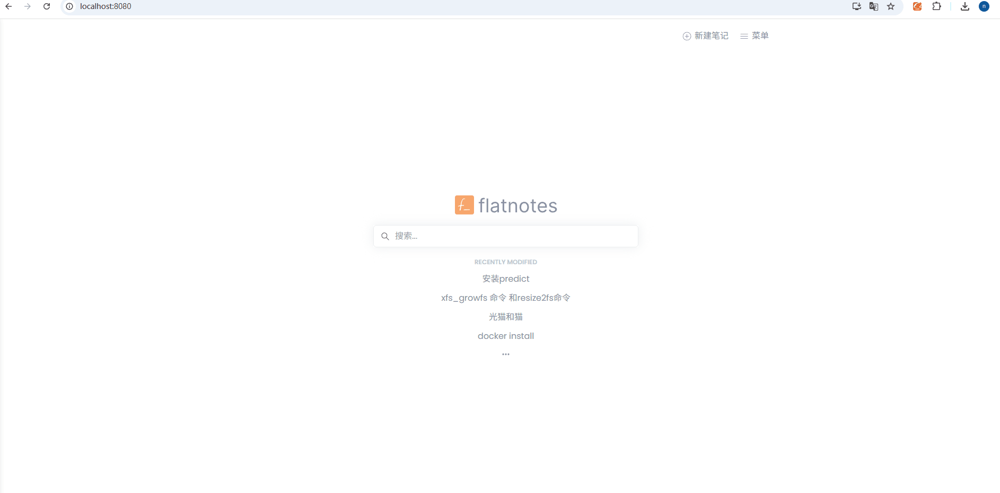

# Flatnotes - 轻量级笔记应用


## 项目简介

Flatnotes 是一个基于浏览器的轻量级笔记应用，使用 Vue.js 和 Python 构建。它提供了简洁的界面和 Markdown 支持，让您可以轻松记录和管理笔记。

该项目是 fork [ flatnotes ](https://github.com/dullage/flatnotes) 按照国人的使用习惯，支持中文搜索和移动端。



## 功能特性

- 📝 支持 Markdown 格式的笔记编辑
- 🔍 全文搜索功能（支持中文）
- 📂 笔记分类管理
- 🌐 响应式设计，适配各种设备

## 快速开始

### 使用Docker运行

```bash
docker run -d \
  -p 8080:8080 \
  -v $(pwd)/data:/data \
  -e FLATNOTES_AUTH_TYPE=password \
  -e FLATNOTES_USERNAME=user \
  -e FLATNOTES_PASSWORD=changeMe! \
  -e FLATNOTES_SECRET_KEY=aLongRandomSeriesOfCharacters \
  dullage/flatnotes:latest
```

### 使用docker-compose

```yaml
version: "3"

services:
  flatnotes:
    image: dullage/flatnotes:latest
    ports:
      - "8080:8080"
    volumes:
      - "./data:/data"
    environment:
      FLATNOTES_AUTH_TYPE: "password"
      FLATNOTES_USERNAME: "user"
      FLATNOTES_PASSWORD: "changeMe!"
      FLATNOTES_SECRET_KEY: "aLongRandomSeriesOfCharacters"
    restart: unless-stopped
```

## 开发

### 技术栈

- 前端: Vue.js
- 后端: Python 3.8+

## 贡献

欢迎提交PR和Issue。

## 许可证

[MIT](LICENSE)
